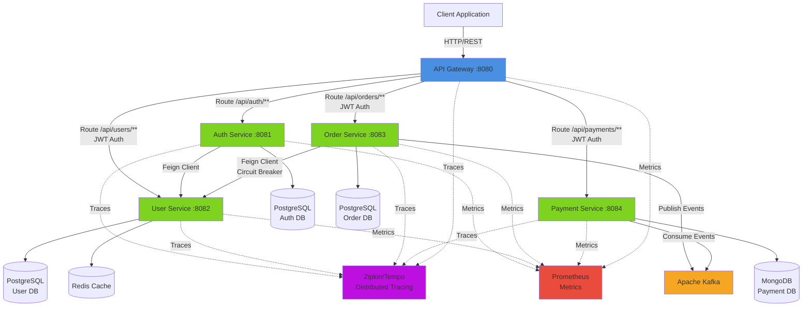

# 🏪 E-Commerce Microservices Platform

A production-ready, cloud-native e-commerce platform built with microservices architecture, demonstrating modern backend development practices with Spring Boot, event-driven communication, and containerized deployment.

## 📋 Overview

This project showcases a complete microservices ecosystem designed to handle user management, authentication, order processing, and payment workflows. Built as a learning project to demonstrate proficiency in distributed systems, inter-service communication, and modern DevOps practices.

**Problem Statement**: Traditional monolithic e-commerce applications struggle with scalability, deployment flexibility, and independent service evolution. This platform addresses these challenges through a microservices architecture that enables independent scaling, technology diversity, and fault isolation.

## 🏗️ Architecture Overview

The system follows a microservices architecture pattern with an API Gateway as the single entry point, service discovery, distributed tracing, and event-driven communication.



### Services

| Service | Port | Description | Database |
|---------|------|-------------|----------|
| **API Gateway** | 8080 | Single entry point, routing, JWT validation, CORS handling | - |
| **Auth Service** | 8081 | User authentication, JWT token generation/validation, registration | PostgreSQL |
| **User Service** | 8082 | User CRUD operations, payment card management, Redis caching | PostgreSQL + Redis |
| **Order Service** | 8083 | Order management, Kafka event publishing, circuit breaker pattern | PostgreSQL |
| **Payment Service** | 8084 | Payment processing, Kafka event consumption, external API integration | MongoDB |

## 🛠️ Tech Stack

### Backend


- **Spring Cloud Gateway** - API Gateway with WebFlux for reactive routing
- **Spring Data JPA** - Data persistence layer
- **Spring Data MongoDB** - NoSQL data access
- **Spring Kafka** - Event-driven messaging
- **Spring Security** - Authentication and authorization
- **OpenFeign** - Declarative REST client for inter-service communication
- **Resilience4j** - Circuit breaker, retry, and fault tolerance
- **MapStruct** - Type-safe bean mapping
- **Liquibase** - Database migration and versioning
- **JWT (JJWT)** - Stateless authentication tokens

### Databases


- **PostgreSQL** - Relational data for Auth, User, and Order services
- **MongoDB** - Document store for Payment service
- **Redis** - Distributed caching for User service

### DevOps & Tools


- **Docker & Docker Compose** - Containerization and orchestration
- **Apache Kafka + Zookeeper** - Event streaming platform
- **Zipkin/Tempo** - Distributed tracing
- **Prometheus** - Metrics collection and monitoring
- **Gradle** - Build automation
- **Lombok** - Boilerplate code reduction

### Testing
- **JUnit 5** - Unit testing framework
- **Testcontainers** - Integration testing with Docker containers
- **Spring Boot Test** - Testing utilities
- **Spring Cloud Contract** - Contract testing for microservices

## ✨ Key Features

### Functional Features
- **User Management**: Complete CRUD operations with role-based access control (ADMIN/USER)
- **Authentication & Authorization**: JWT-based stateless authentication with access and refresh tokens
- **Payment Card Management**: Users can manage multiple payment cards (configurable limit)
- **Order Processing**: Create, update, and track orders with status management
- **Payment Processing**: Automated payment handling with external API integration
- **Event-Driven Workflow**: Asynchronous order-to-payment flow via Kafka

### Technical Features
- **API Gateway Pattern**: Centralized routing, authentication, and CORS handling
- **Service-to-Service Communication**: OpenFeign clients with declarative REST calls
- **Circuit Breaker Pattern**: Resilience4j for fault tolerance in Order Service
- **Distributed Caching**: Redis for improved User Service performance
- **Event-Driven Architecture**: Kafka for decoupled order and payment processing
- **Distributed Tracing**: Zipkin/Tempo integration for request tracking across services
- **Metrics & Monitoring**: Prometheus endpoints for observability
- **Database Migration**: Liquibase for version-controlled schema changes
- **Containerization**: Full Docker Compose setup for local development
- **Security**: Gateway-level JWT validation with header propagation to downstream services

## 💾 Database Design

### Auth Service (PostgreSQL)
- **refresh_tokens**: Stores refresh tokens for JWT authentication
  - `id`, `token`, `user_id`, `expiry_date`, `created_at`

### User Service (PostgreSQL)
- **users**: Core user information
  - `id`, `name`, `surname`, `email`, `password_hash`, `birth_date`, `role`, `active`, `created_at`, `updated_at`
- **payment_cards**: User payment methods
  - `id`, `user_id`, `card_number`, `card_holder_name`, `expiry_date`, `cvv`, `created_at`, `updated_at`
- **Redis Cache**: User and card data with configurable TTL (5-10 minutes)

### Order Service (PostgreSQL)
- **orders**: Order header information
  - `id`, `user_id`, `status`, `total_amount`, `deleted`, `created_at`, `updated_at`
- **items**: Order line items
  - `id`, `order_id`, `product_name`, `quantity`, `price`, `created_at`, `updated_at`

### Payment Service (MongoDB)
- **payments**: Payment transaction records
  - `_id`, `orderId`, `userId`, `amount`, `status`, `transactionId`, `createdAt`, `updatedAt`

## 🚀 Getting Started

### Prerequisites
- **Java 21** or higher
- **Docker** and **Docker Compose**
- **Gradle** (or use included wrapper)
- **Git**

### Installation & Setup

1. **Clone the repository**
```bash
git clone https://github.com/[your-username]/[repo-name].git
cd [repo-name]
```

2. **Configure environment variables**
```bash
cp .env.example .env
```

Edit `.env` file with your configuration:
```env
# JWT Configuration
JWT_ACCESS_KEY=your-secret-access-key-here
JWT_REFRESH_KEY=your-secret-refresh-key-here

# Service Ports
API_GATEWAY_SERVICE_APP_PORT=8080
USER_SERVICE_APP_PORT=8082
AUTH_SERVICE_APP_PORT=8081
ORDER_SERVICE_APP_PORT=8083
PAYMENT_SERVICE_APP_PORT=8084

# Database Ports
USER_SERVICE_DB_PORT=5432
AUTH_SERVICE_DB_PORT=5433
ORDER_SERVICE_DB_PORT=5434
PAYMENT_SERVICE_DB_PORT=27017
USER_SERVICE_REDIS_PORT=6379

# Database Credentials (change for production!)
USER_SERVICE_DB_USERNAME=postgres
USER_SERVICE_DB_PASSWORD=postgres
# ... (configure other services similarly)
```

3. **Build all services**
```bash
# Build all services at once
./gradlew clean build -x test

# Or build individual services
cd user-service && ./gradlew clean build -x test
cd auth-service && ./gradlew clean build -x test
cd order-service && ./gradlew clean build -x test
cd payment-service && ./gradlew clean build -x test
cd api-gateway && ./gradlew clean build -x test
```

4. **Start the application**
```bash
docker-compose up -d
```

5. **Verify services are running**
```bash
docker-compose ps
```

All services should show as "Up". Check health endpoints:
- API Gateway: http://localhost:8080/actuator/health
- User Service: http://localhost:8082/api/actuator/health
- Auth Service: http://localhost:8081/api/actuator/health
- Order Service: http://localhost:8083/api/actuator/health
- Payment Service: http://localhost:8084/api/actuator/health

6. **View logs** (optional)
```bash
# All services
docker-compose logs -f

# Specific service
docker-compose logs -f user-service-app
```

7. **Stop the application**
```bash
docker-compose down

# Remove volumes (clean database)
docker-compose down -v
```

## 📡 API Documentation

### Authentication Endpoints

| Method | Endpoint | Description | Auth Required |
|--------|----------|-------------|---------------|
| POST | `/api/auth/registration` | Register new user | ❌ |
| POST | `/api/auth/login` | Login and get JWT tokens | ❌ |
| POST | `/api/auth/refresh` | Refresh access token | ❌ |
| POST | `/api/auth/validate` | Validate JWT token | ❌ |

### User Management Endpoints

| Method | Endpoint | Description | Auth Required |
|--------|----------|-------------|---------------|
| GET | `/api/users/{id}` | Get user by ID | ✅ (Owner/Admin) |
| GET | `/api/users` | Get all users (paginated, filterable) | ✅ (Admin) |
| GET | `/api/users/email/{email}` | Get user by email | ✅ (Admin) |
| POST | `/api/users` | Create new user | ❌ |
| PUT | `/api/users/{id}` | Update user | ✅ (Owner/Admin) |
| DELETE | `/api/users/{id}` | Delete user | ✅ (Admin) |
| PATCH | `/api/users/{id}/activate` | Activate user account | ✅ (Admin) |
| PATCH | `/api/users/{id}/deactivate` | Deactivate user account | ✅ (Admin) |

### Payment Card Endpoints

| Method | Endpoint | Description | Auth Required |
|--------|----------|-------------|---------------|
| GET | `/api/users/{userId}/cards` | Get user's payment cards | ✅ (Owner/Admin) |
| POST | `/api/users/{userId}/cards` | Add payment card | ✅ (Owner/Admin) |
| PUT | `/api/users/{userId}/cards/{cardId}` | Update payment card | ✅ (Owner/Admin) |
| DELETE | `/api/users/{userId}/cards/{cardId}` | Delete payment card | ✅ (Owner/Admin) |

### Order Endpoints

| Method | Endpoint | Description | Auth Required |
|--------|----------|-------------|---------------|
| POST | `/api/orders` | Create new order | ✅ |
| GET | `/api/orders` | Get all orders (paginated, filterable) | ✅ |
| GET | `/api/orders/{id}` | Get order by ID | ✅ |
| GET | `/api/orders/user/{userId}` | Get orders by user ID | ✅ |
| PUT | `/api/orders/{id}` | Update order | ✅ |
| DELETE | `/api/orders/{id}` | Soft delete order | ✅ |

### Payment Endpoints

| Method | Endpoint | Description | Auth Required |
|--------|----------|-------------|---------------|
| POST | `/api/payments` | Create payment | ✅ |
| GET | `/api/payments/user/{userId}` | Get payments by user | ✅ |
| GET | `/api/payments/order/{orderId}` | Get payments by order | ✅ |
| GET | `/api/payments/status?status={status}` | Get payments by status | ✅ |
| GET | `/api/payments/total-sum` | Get total sum for user (date range) | ✅ |
| GET | `/api/payments/admin/total-sum` | Get total sum for all users | ✅ (Admin) |

### Example Requests

**Register a new user:**
```bash
curl -X POST http://localhost:8080/api/auth/registration \
  -H "Content-Type: application/json" \
  -d '{
    "name": "John",
    "surname": "Doe",
    "email": "john.doe@example.com",
    "password": "SecurePass123!",
    "birthDate": "1990-01-15"
  }'
```

**Login:**
```bash
curl -X POST http://localhost:8080/api/auth/login \
  -H "Content-Type: application/json" \
  -d '{
    "email": "john.doe@example.com",
    "password": "SecurePass123!"
  }'
```

**Create an order (with JWT token):**
```bash
curl -X POST http://localhost:8080/api/orders \
  -H "Content-Type: application/json" \
  -H "Authorization: Bearer YOUR_JWT_TOKEN" \
  -d '{
    "userId": 1,
    "items": [
      {
        "productName": "Laptop",
        "quantity": 1,
        "price": 999.99
      }
    ]
  }'
```

## 🔮 Future Roadmap

### Short-term Enhancements
- [ ] **Service Discovery**: Integrate Eureka or Consul for dynamic service registration
- [ ] **Config Server**: Centralized configuration management with Spring Cloud Config
- [ ] **API Documentation**: Swagger/OpenAPI integration for interactive API docs
- [ ] **Rate Limiting**: Implement request throttling at the gateway level
- [ ] **Frontend Application**: React/Vue.js SPA to consume the APIs

### Medium-term Goals
- [ ] **Kubernetes Deployment**: Helm charts and K8s manifests for cloud deployment
- [ ] **CI/CD Pipeline**: GitHub Actions/Jenkins for automated testing and deployment
- [ ] **Enhanced Security**: OAuth2/OIDC integration, API key management
- [ ] **Message Queue Improvements**: Dead letter queues, retry mechanisms
- [ ] **Advanced Caching**: Distributed cache invalidation strategies

### Long-term Vision
- [ ] **GraphQL Gateway**: Alternative API interface for flexible data fetching
- [ ] **Event Sourcing**: CQRS pattern for order and payment services
- [ ] **Multi-tenancy**: Support for multiple organizations
- [ ] **Real-time Notifications**: WebSocket integration for order status updates
- [ ] **Analytics Dashboard**: Business intelligence and reporting features
- [ ] **Mobile API**: Optimized endpoints for mobile applications

## 📊 Monitoring & Observability

### Distributed Tracing
Access Zipkin UI at `http://localhost:9411` (when configured) to visualize request flows across services.

### Metrics
Prometheus metrics are exposed at `/actuator/prometheus` on each service:
- `http://localhost:8080/actuator/prometheus` (API Gateway)
- `http://localhost:8082/api/actuator/prometheus` (User Service)
- `http://localhost:8081/api/actuator/prometheus` (Auth Service)
- `http://localhost:8083/api/actuator/prometheus` (Order Service)
- `http://localhost:8084/api/actuator/prometheus` (Payment Service)

### Health Checks
Health endpoints available at `/actuator/health` for each service.

## 🧪 Testing

Run tests for all services:
```bash
./gradlew test
```

Run tests for a specific service:
```bash
cd user-service && ./gradlew test
```

The project includes:
- Unit tests with JUnit 5
- Integration tests with Testcontainers (PostgreSQL, MongoDB, Kafka)
- Contract tests with Spring Cloud Contract

## 📝 License

This project is open source and available under the [MIT License](LICENSE).

## 👤 Author

**[Your Name]**
- GitHub: [@your-username](https://github.com/your-username)
- LinkedIn: [Your LinkedIn](https://linkedin.com/in/your-profile)
- Email: your.email@example.com

## 🙏 Acknowledgments

- Spring Boot and Spring Cloud teams for excellent frameworks
- The open-source community for amazing tools and libraries
- [Innowise Group](https://innowise.com/) for project inspiration

---

⭐ If you found this project helpful, please consider giving it a star!
